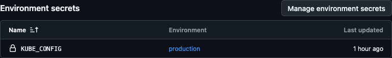

+++
date = '2025-11-07T15:32:22+13:00'
draft = false
title = 'Easy Kubernetes Continuous Deployment with Github Actions'
summary = 'A quick and easy way to do instant deployments to Kubernetes with Github Actions'
tags = ["Kubernetes", "Tutorial"]

+++
So, I finally got around to making a portfolio site for the Tinkering Kiwi project. You're looking at it, baby! For this, I went with the [Hugo](https://gohugo.io) static site generator and the [Blowfish](https://blowfish.page/) theme. I've always liked the simplicity of just building a static site that you can deploy anywhere. So of course, I had to make it more complicated by adding Kubernetes and automatic continuous deployment.

If you're new to Kubernetes, check out my post [Kubernetes Demystified](../kubernetes-demystified/) to learn some of the concepts this post will cover. 

## Why Kubernetes?

Kubernetes is just how my brain works. I think once you learn Kubernetes, you love the way it makes you do things right first time, and all the built in magic like DNS, healthchecks and automatic recovery from most issues. You can also get a really cheap cluster from [Rackspace Spot](https://spot.rackspace.com). I tend to deploy most apps I build to my Spot cluster, using a setup similar to what I'm describing here. By adding continuous deployment to my simple static website, I'll be able to reuse it for other projects.

## Building the Site
To deploy the site, I'm first going to have to build it into a Docker image. If you're following this as a tutorial, you could just ask your favourite LLM to build a simple echo server in your language of choice. I just asked Copilot to write a Dockerfile that builds my static site and this is what I got:
```dockerfile {filename="Dockerfile"}
FROM ghcr.io/hugomods/hugo:debian-nightly AS builder

WORKDIR /src
COPY . /src

# Build the site (and minify)
RUN hugo --minify

# Find all text files and create a compressed version
RUN find public -type f \
     \( -iname "*.html" -o -iname "*.css" -o -iname "*.js" -o -iname "*.xml" -o -iname "*.json" -o -iname "*.svg" -o -iname "*.txt" \) \
     -print0 | xargs -0 -n1 sh -c 'gzip -9 -n -c "$0" > "${0}.gz"' 

# Stage 2: nginx to serve the generated site
FROM nginx:stable-alpine AS final

RUN rm -rf /usr/share/nginx/html/*

# Copy files into Nginx 
COPY docker/nginx.conf /etc/nginx/conf.d/default.conf
COPY --from=builder /src/public /usr/share/nginx/html

# Update permissions
RUN chown -R nginx:nginx /usr/share/nginx/html || true

EXPOSE 80

# Run nginx in the foreground
CMD ["nginx", "-g", "daemon off;"]
```
The site builds and runs very quickly, hugo generates pages super fast and the gzip compression of a handful of files takes less than a second. 

Build and test the Docker container locally by running the following commands:
```bash
docker build -t home-page:latest .
docker run --rm -p 8080:80 home-page:latest
```

Open [localhost:8080](http://localhost:8080) in your browser and check the site loads and works as expected.

## Building with Github
Now it's time to automate building the site with Github Actions. I build the Docker image and push it into the Github Container Registry, which is free for all public repos. I don't mind storing the site like this, since it's public static HTML anyway. 
```yaml {filename=".github/workflows/docker.yaml"}
name: Build & Publish Docker image

on:
  push:
    branches: [ main ]
  workflow_dispatch:

permissions:
  contents: read
  packages: write

jobs:
  build-and-push:
    name: Build and push to GHCR
    runs-on: ubuntu-latest

    steps:
      - name: Checkout repository (including submodules)
        uses: actions/checkout@v4
        with:
          submodules: 'recursive'
          fetch-depth: 0

      - name: Log in to GitHub Container Registry
        uses: docker/login-action@v2
        with:
          registry: ghcr.io
          username: ${{ github.actor }}
          password: ${{ secrets.GITHUB_TOKEN }}

      - name: Build and push image
        uses: docker/build-push-action@v4
        with:
          context: .
          file: Dockerfile
          push: true
          tags: |
            ghcr.io/tinkeringkiwi/home-page:latest
            ghcr.io/tinkeringkiwi/home-page:${{ github.sha }}
```

This Workflow will pull your code, log in to the container registry, then build and push the image. I had an issue early on where the site wasn't building HTML output properly, this was due to the theme being a Git submodule, and the fix was adding `submodules = 'recursive'` to the checkout step. 

## Enter Kubernetes
Once the site is built and pushed to Github Container Registry, it's pretty easy to deploy to Kubernetes. Once again I asked Copilot to write a Kubernetes manifest to deploy the image that had been built, here is an overview, see the [full version here](https://github.com/tinkeringkiwi/home-page/blob/6982619d3d3fff29eb6ad5253d038ddb7355ef29/kubernetes/deployment.yaml)
```yaml
apiVersion: v1
kind: Namespace
metadata:
  name: portfolio
---
apiVersion: apps/v1
kind: Deployment
metadata:
  name: home-page
  namespace: portfolio
spec:
  replicas: 2
  template:
    spec:
      automountServiceAccountToken: false
      containers:
        - name: web
          image: ghcr.io/tinkeringkiwi/home-page:latest
          imagePullPolicy: Always # Important later
          ports:
            - containerPort: 80
              name: http
---
apiVersion: v1
kind: Service
metadata:
  name: home-page
  namespace: portfolio
---
apiVersion: networking.k8s.io/v1
kind: Ingress
metadata:
  name: home-page-ingress
  namespace: portfolio
spec:
  ingressClassName: nginx
  rules:
    - host: tinkering.kiwi

```
This creates a namespace to hold all the resources for the site, a deployment of the container image, a service for the site, and an ingress using Nginx to allow outside access. 

Applying the manifest will deploy the site to the Kubernetes cluster:
```bash
kubectl apply -f deployment.yaml
kubectl -n portfolio get pods -w # Watch the pods come up
# Debugging commands if needed :) 
kubectl -n portfolio describe pod home-page-foo
kubectl -n portfolio logs home-page-foo
```

Congrats, the site is now live on your Kubernetes cluster! 

### Redeploying the Site
Since I've set `imagePullPolicy: Always`, when I make changes to the site I can deploy the new image Github Actions has built just by running
```
kubectl -n portfolio rollout restart deployment/home-page
```
When you do this, you get all the Kubernetes magic. For example, if the new image is broken and fails health checks, or Nginx fails to start due to a bad config, the old version of the deployment will be kept, and only the new deployment will fail. If the new deployment is successful, traffic will be switched over to the new version, and the old version gracefully retired. Not really necessary for a personal blog, but very neat!

## Adding Automated Deployment 

Wouldn't it be swell if I could just push changes to my site to Github, and they be automatically deployed to the Kubernetes cluster?

### Create a Service Account
To give Github minimal permissions to automate this re-deployment of our image, we need to create another few things in Kubernetes
```yaml
apiVersion: v1
kind: ServiceAccount
metadata:
  name: github-actions
  namespace: portfolio # Ensure this matches your target namespace
---
apiVersion: rbac.authorization.k8s.io/v1
kind: Role
metadata:
  name: deployment-restarter
  namespace: portfolio # or your target namespace
rules:
- apiGroups: ["apps"]
  resources: ["deployments"]
  verbs: ["patch", "get"]
---
apiVersion: rbac.authorization.k8s.io/v1
kind: RoleBinding
metadata:
  name: deployment-restarter-binding
  namespace: portfolio # or your target namespace
subjects:
- kind: ServiceAccount
  name: github-actions # The Service Account associated with the token
  namespace: portfolio # or your target namespace
roleRef:
  kind: Role
  name: deployment-restarter
  apiGroup: rbac.authorization.k8s.io
```
This creates a Service Account called github-actions, a Role which only has permissions to perform `patch` and `get` on Deployments in the `portfolio` namespace, and a RoleBinding which binds the two together. 

### Create a Token for the Service Account
```bash
kubectl -n portfolio create token github-actions --duration=8760h
```
This creates a token for the github-actions Kubernetes Service Account that expires in one year, which we can use in the next step to assemble a Kubeconfig file for Github Actions. 

### Create a Kubeconfig File
I created a complete Kubeconfig file based on my existing administrator config. 
```yaml
apiVersion: v1
kind: Config
clusters:
- name: gh-actions-cluster
  cluster:
    server: <insert here>
    insecure-skip-tls-verify: false
    certificate-authority-data: <insert here>
users:
- name: github-actions
  user:
    token: <insert here>
contexts:
- name: gh-actions-context
  context:
    cluster: gh-actions-cluster
    user: github-actions
current-context: gh-actions-context
```
Look at your own kubeconfig file to see what values are needed for `cluster.server` and `cluster.certificate-authority-data`, then add the token under the user. 
```bash
cat ~/.kube/config # Refer to your config
```

### Test the New Kubeconfig
You can test the Kubeconfig file you've created by specifying it to `kubectl`, this will make sure it works before you try debugging Github Actions.
```
kubectl --kubeconfig=file.yaml -n portfolio rollout restart deployment/home-page
```
If all goes well, you should see `deployment.apps/home-page restarted`


### Add the Kubeconfig to Github Actions Secrets
Add the entire contents of the Kubeconfig file you've just crafted to a secret in Github Actions, or an Environment Secret as I've done. 


### Add Restart Job to Github Actions
Now we can finally get the continuous deployment running. Add a second Job to the Github Actions workflow we created earlier:
```yaml
  deploy:
    name: Deploy (kubectl restart)
    needs: build-and-push
    runs-on: ubuntu-latest
    environment: production # If you used Environment Secrets
    steps:
      - name: Install kubectl
        uses: azure/setup-kubectl@v3
        with:
          version: 'v1.32.7'

      - name: Log in to Kubernetes
        uses: azure/k8s-set-context@v3
        with:
          kubeconfig: ${{ secrets.KUBE_CONFIG }}
          
      - name: Restart deployment
        run: |
          kubectl rollout restart deployment/home-page -n portfolio
```

## Instant Deployment
If all goes well, you should see the `deployment.apps/home-page restarted` message that your continuous deployment was successful in the Github Actions run.


## Going Further
Now that Github Actions can interact with your Kubernetes cluster directly, there's all sorts of ways to get creative with this. You could give the github-actions Service Account more permissions, and let it run `kubectl apply` for you. You could have a staging deployment to a different namespace or cluster. Personally, I find most updates I want to do are to the application code itself, so I'm happy to apply tweaks to the deployment configuration manually, then let Github simply refresh to the new update. 

## Conclusion
Of course this is entirely unnecessary for a simple static website such as this personal blog, but it's super cool to be able to publish content instantly by just committing it to Github. Unnecessary projects like this are exactly what being a Tinkering Kiwi is all about. 

## Further Reading
I created a post [Kubernetes Demystified](../kubernetes-demystified/) to go over the basics of Kubernetes, if you're new or want a refresher on the concepts used in this article. 