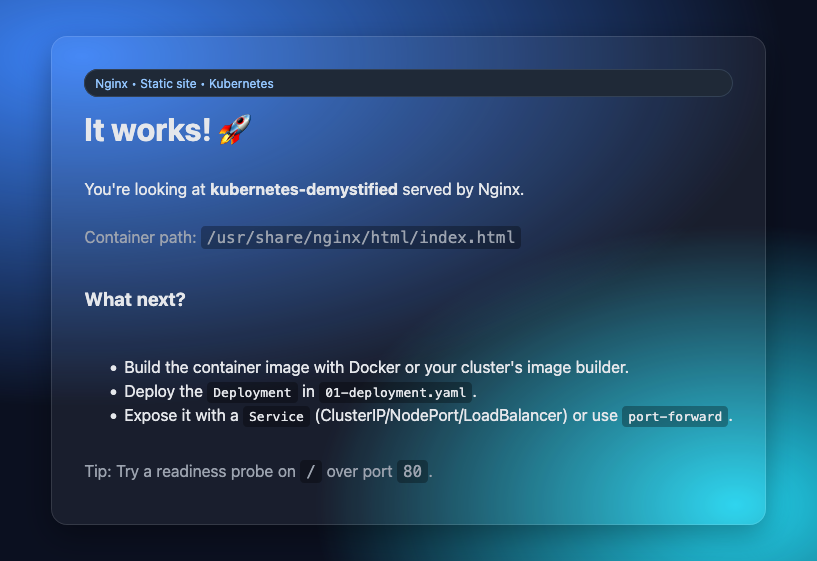

+++
date = '2025-11-10T09:56:15+13:00'
tags = ["Kubernetes", "tutorial"]
category = 'Kubernetes'
title = 'Kubernetes Demystified'
summary = "My introduction to Kubernetes, how to run containerised applications if you're familiar with Docker."
+++
I wanted to follow up my previous post on [easy Kubernetes continuous deployment](../easy-kubernetes-continuous-deploy/) with a more general post covering the basics of Kubernetes. Kubernetes is a powerful tool that I think a lot of people just plain overthink. If you can do what you're probably already doing with Docker on Kubernetes, you can tap into its power and flexibility when you *need* it.

## What is Kubernetes?
Kubernetes, in this context, is to Docker, what Proxmox or AWS is to Virtual Box. You can run containers and attach volumes to them just like Docker. Then, using the power of Kubernetes' composability, you can do far more than that. Or not.

To follow along, I recommend installing [OrbStack](https://orbstack.dev/) for Mac, or Docker Desktop and enabling their Kubernetes engine. 

### Docker
What is Docker? It's a way to package applications, along with the system around them, and then run them easily.

```
docker run -it --rm busybox sh
```
This will create and run a container with the busybox image, and give you a shell. In another terminal, if you run `docker ps`, you will get an output like this:
```
CONTAINER ID   IMAGE                        COMMAND                  CREATED              STATUS              PORTS     NAMES
1a857cb61ebf   busybox                      "sh"                     49 seconds ago       Up 48 seconds                 pedantic_wilson
```
You can now type `exit` in the busybox shell and the container will be deleted entirely. 

### Kubernetes
Kubernetes can do the exact same thing! 
```
kubectl run -it --rm --image busybox sh
```
You're now at a Busybox shell, and can run all the commands you would expect. In another terminal, if you run `kubectl get pods`, you will get an output like this:
```
NAME    READY   STATUS    RESTARTS      AGE
sh      1/1     Running   0             14s
```

### The Difference 
The big difference here, is that this is how Docker is designed to be operated. Kubernetes, however, expects to be operated *declaratively*. This won't be unfamiliar to you if you've used Docker Compose to spin up a development stack. It's also similar to using something like Terraform on a hyperscaler cloud. 

## Composability

Before we get into it, we have to take one detour to talk about Kubernetes' focus on *composability*. The design of Kubernetes emphasizes creating composable building blocks that you can then build into the application you desire, or wrap up into higher-level building blocks. You might think of this as similar to creating a "serverless" function on a cloud service, where a server, some networking and storage are provisioned for us transparently. This means two things for this task:
- We don't say "run a pod", we tell Kubernetes *how* we want our pods run.
- We tell Kubernetes what we want, and Kubernetes determines how to get to that state. 

### Workloads
Kubernetes gives us multiple *workload* types we can run, which define how we want our pods run, they are,
- **Deployments** - this is what you'll use most of the time, it says we want to run a certain number of pods until we say otherwise. Think of this as a much more robust version of `--restart=Always` in Docker.
- **StatefulSets** - this defines a set of numbered, persistent pods. They're useful for running things like Databases. 
- **Jobs** and **CronJobs** - Jobs are pods that run to completion, they might be used to run a one off job like building an image, or running database migrations. CronJobs contain within them a Job that is run on a schedule.

All of these Kubernetes objects create and manage Pods for us. In the case of a CronJob, it creates and manages Jobs which create and manage Pods for us. 

## Hello World
Let's try running a simple Hello World containerised application. If you check out the companion repo to this post, you'll get all the files you need. While all this YAML might seem overwhelming at first, remember, you can always just ask your favourite LLM companion to write it all for you.


```
git clone https://github.com/tinkeringkiwi/kubernetes-demystified.git
```
This will clone a repo with a few files: 
- **Dockerfile** - a simple Dockerfile which builds a static HTML app.
- **index.html** - our static app.
- **01-deployment.yaml** - the Kubernetes Deployment manifest for our application.

```
docker build -t kubernetes-hello-world .
```
This will build our container image and tag it so we can run it later. Now let's run it on Kubernetes:
```
kubectl apply -f 01-deployment.yaml
```
You should see output like `deployment.apps/k8s-demo created`. 

### Inspect the Pods

Now you can run `kubectl get pods` as above and you should see output like:
```
NAME                      READY   STATUS    RESTARTS   AGE
k8s-demo-6576f84f-xdzlj   1/1     Running   0          9s
```

**Tip:** If you see `ErrImagePull` instead of `Running`, your Kubernetes environment simply isn't hooked up to your local image store like [OrbStack](https://orbstack.dev/)'s. Usually there's a command you can run to upload the image to your Kubernetes runtime. However, to keep things simple, I included a script to temporarily upload the image to [ttl.sh](https://ttl.sh/). Simply run `./build-and-push-ttl.sh`, and then run the `kubectl apply` command again.


### Inspect the Deployment
We can also run the same command to check the Deployment. 
```
kubectl get deployments
```
```
NAME       READY   UP-TO-DATE   AVAILABLE   AGE
k8s-demo   1/1     1            1           6m29s
```

### Kubectl Describe
If there's any issue with the deployment or pod, here's where we can start using the power of Kubernetes to debug. You can `describe` any Kubernetes object to get way more information about it. 
```
kubectl describe deployment k8s-demo
# Or
kubectl describe pod -l app=k8s-demo
```

I have used Kubernetes' powerful [labels](https://kubernetes.io/docs/concepts/overview/working-with-objects/labels/) system to select the pod. Don't worry too much, it just means I don't have to guess what your pod's random ID is!


The `describe` command brings up a ton of useful information! If you can't figure out why your pod isn't running, you'll probably find the answer here.
```
Name:             k8s-demo-5bb994bd6d-xx64j
Namespace:        default
Priority:         0
Service Account:  default
Node:             [OrbStack](https://orbstack.dev/)/192.168.139.2
Start Time:       Mon, 17 Nov 2025 10:56:24 +1300
Labels:           app=k8s-demo
                  pod-template-hash=5bb994bd6d
Annotations:      <none>
Status:           Running
Controlled By:  ReplicaSet/k8s-demo-5bb994bd6d
Containers:
  web:
    Container ID:   docker://5bd52103f4dc2c167e210e74781e4836567bdc81a5b8edd4c1d1aa2ec4a15c2a
    Image:          ttl.sh/4bf6f71d-c98e-45c4-aa6d-b1b4fde2e600:5m
    Port:           80/TCP (http)
    Host Port:      0/TCP (http)
    State:          Running
      Started:      Mon, 17 Nov 2025 10:56:25 +1300
    Ready:          True
    Restart Count:  0
    Limits:
      cpu:     200m
      memory:  128Mi
    Requests:
      cpu:        50m
      memory:     64Mi
    Liveness:     http-get http://:http/ delay=5s timeout=1s period=10s #success=1 #failure=3
    Readiness:    http-get http://:http/ delay=2s timeout=1s period=5s #success=1 #failure=3
    Environment:  <none>

Conditions:
  Type                        Status
  PodReadyToStartContainers   True 
  Initialized                 True 
  Ready                       True 
  ContainersReady             True 
  PodScheduled                True 
Events:
  Type    Reason     Age   From               Message
  ----    ------     ----  ----               -------
  Normal  Scheduled  9m1s  default-scheduler  Successfully assigned default/k8s-demo-5bb994bd6d-xx64j to [OrbStack](https://orbstack.dev/)
  Normal  Pulled     9m1s  kubelet            Container image "ttl.sh/4bf6f71d-c98e-45c4-aa6d-b1b4fde2e600:5m" already present on machine
  Normal  Created    9m1s  kubelet            Created container: web
  Normal  Started    9m1s  kubelet            Started container web
```

## Connecting to the App
I'm going to give you a small taste of probably my favourite thing about Kubernetes: The absolutely magical way it handles networking and DNS for your applications. 

Back to Docker for a bit. You're probably used to using port forwards to access your applications. You forward a port from your local machine, into the container, and access it over that. In Kubernetes world, everything instead gets wrapped into a magic network where everything just makes sense. 

However, you can still do that port forwarding if you like, and this is a great way to debug things.
```
kubectl port-forward k8s-demo-5bb994bd6d-xx64j 8080:80
```
This forwards [localhost:8080](http://localhost:8080) to port 80 on the specified Pod. Open up the address and we can see our beautiful AI generated app!


### Services
This brings us to our next composable building block offered by Kubernetes: Services! We can define a Service, tell Kubernetes that it points to our application, and then other Pods can easily access it. DNS and load balancing are handled for us automagically by Kubernetes. Here is a basic Service manifest:
```yaml
apiVersion: v1
kind: Service
metadata:
  name: k8s-demo
  labels:
    app: k8s-demo
spec:
  type: ClusterIP
  selector:
    app: k8s-demo
  ports:
    - name: http
      port: 80
      targetPort: http
```
In this manifest we're describing a Service called `k8s-demo` and telling Kubernetes to send traffic to that service to the Pods with the label `app: k8s-demo`. We are forwarding port 80 on that service to the port called `http` on those pods. In other words `service:80` goes to our Nginx Pods, as expected.

With Kubernetes Services, consumers don't have to think about what target to use, how to find them, or what port they might be running on. They can just target the Service as a persistent endpoint with load balancing. 

Apply the service now from the demo repo:
```
kubectl apply -f 02-service.yaml
```

Now let's go right back to the start of the tutorial, and create a Pod to test the Service. 
```
kubectl run busybox -it --rm --image busybox sh
```
In the shell that appears, we can now run `wget -O - k8s-demo`, and see the beautiful code of our demo application. We don't have to worry about ports or anything, just connect to `k8s-demo`.


If you're using [OrbStack](https://orbstack.dev/), services are magically plumbed into your machine. You can access [k8s-demo.default.svc.cluster.local](http://k8s-demo.default.svc.cluster.local) and see the service just like you're in the cluster! Great for development.


Oh, and you can also `port-forward` to this service, and access it for debugging.
```
kubectl port-forward service/k8s-demo 8080:80
```

## Storage
The last piece of the puzzle is storage. You're probably used to mounting local directories on your local machine into Docker containers, or using Docker's named volumes.

Kubernetes provides volumes as another building block we can attach to our Pods, just like Services. In Kubernetes land, these can be from all sorts of places, like Cloud provider block volumes, a shared filesystem, or even an S3 bucket, and your application doesn't have to know or care about the details. In our case, we don't have to worry about any of that, we're just going to use the volumes provisioned on our local machine, provided by default by your Kubernetes runtime. 

Here is a look at an example volume: 
```yaml
apiVersion: v1
kind: PersistentVolumeClaim
metadata:
  name: nginx-web-root
spec:
  accessModes:
    - ReadWriteOnce
  resources:
    requests:
      storage: 1Gi
```
In this case, we're creating a PersistentVolumeClaim, and Kubernetes will dynamically provision the underlying storage (called a PersistentVolume) for us. This is how you'll do it 90% of the time, unless you need some advanced control over the PersistentVolume.


By the way, you can also mount a local directory into Kubernetes for development. Look into [HostPath volumes](https://kubernetes.io/docs/concepts/storage/volumes/) or ask your LLM to add one.

## Putting it All Together
In `03-full-example.yaml` in the tutorial repo, I've created a "production-ready" Nginx Deployment to host our app. It creates a Deployment of Nginx Pods, a Service to access them, and a PersistentVolumeClaim to store the web content. 

Let's deploy it now:
```sh
kubectl apply -f 03-full-example.yaml
```
```
deployment.apps/nginx-full created
service/nginx-full created
persistentvolumeclaim/nginx-web-root created
```
Now, we need to copy our static content to the newly created volume. 
```bash
POD=$(kubectl get pod -l app=nginx-full -o jsonpath='{.items[0].metadata.name}')
kubectl cp ./index.html "$POD":/usr/share/nginx/html/index.html -c nginx
```

This will select the first Pod in the deployment, and copy the file to the Nginx root. You can now use any of the methods we discussed above in [Services](#services) to access the new service, and check the app is there.

You can now [scale up](https://kubernetes.io/docs/tasks/run-application/horizontal-pod-autoscale/) your Nginx cluster infinitely, or delete the deployment entirely, and the `index.html` file will still be there. 
```
kubectl delete deployment nginx-full
# deployment.apps "nginx-full" deleted from default namespace

kubectl apply -f 03-full-example.yaml
# deployment.apps/nginx-full created
# service/nginx-full unchanged
# persistentvolumeclaim/nginx-web-root unchanged

kubectl scale deployment nginx-full --replicas=12
# deployment.apps/nginx-full scaled

kubectl get pods -w # watch as new replicas are deployed
```

## Cleaning Up
Before we finish, we should delete everything we created in this tutorial. Pretty easy to do thanks to Kubernetes' declarative management.
```
kubectl delete -f 01-deployment.yaml,02-service.yaml,03-full-example.yaml
```
Kubernetes will clean up all our deployed resources:
```
deployment.apps "k8s-demo" deleted from default namespace
service "k8s-demo" deleted from default namespace
deployment.apps "nginx-full" deleted from default namespace
service "nginx-full" deleted from default namespace
persistentvolumeclaim "nginx-web-root" deleted from default namespace
```


## Conclusion
In this post, we've only scratched the surface of what Kubernetes is capable of, but we've also covered everything you need to know to get building on top of Kubernetes. We've also covered nearly all of what Docker is capable of. Once you have built and deployed your apps on top of Kubernetes with what you've learned today, Kubernetes will always be ready for you to [sprinkle on](https://www.crossplane.io/) a little of the [magic](https://kubernetes.io/docs/tasks/run-application/horizontal-pod-autoscale/) it's [capable of](https://github.com/awslabs/mountpoint-s3-csi-driver) here and there, when you actually need it. 

## Further Reading
Check out my post [Easy Kubernetes Continuous Deployment with Github Actions](../easy-kubernetes-continuous-deploy/) for a real-world example of how I deploy this site using Kubernetes.